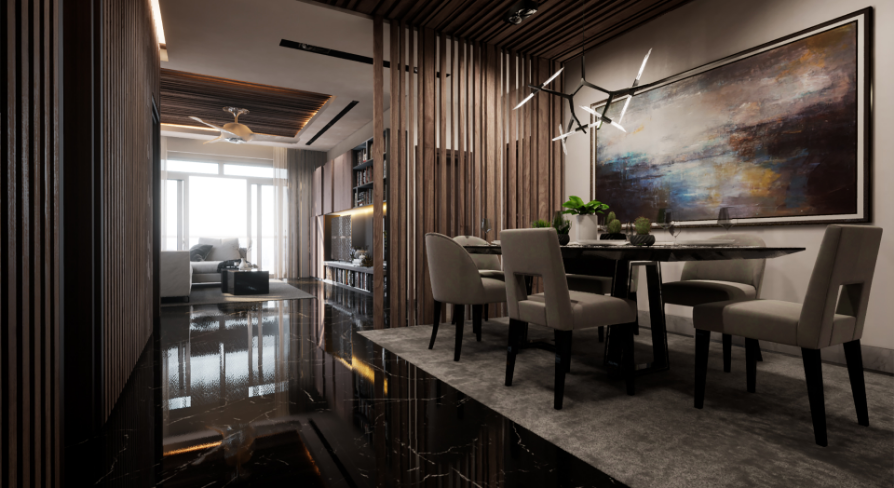
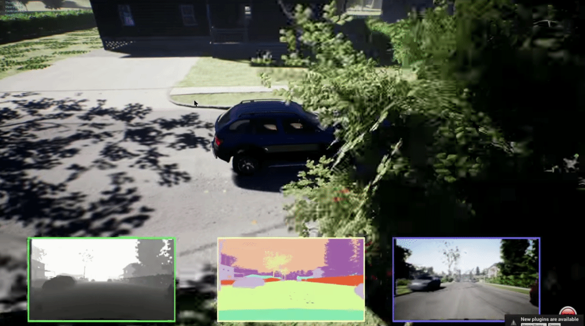

### Quiz

:warning: Confidential content please do not spread

---

Task description:

It's impossible to exhaust search the real-world environment and generate enough dataset to train a robot to perceive the world, there comes to simulators.

Our goal is to build a pipeline that can generate a indoor scene simulator that a robot can roam freely and, at the same time, it can yield the randomized scenario (random light condition, random color, random permutation of facilities and cluttered objects) on-the-fly.

Luckily @Microsoft and @UnrealEngine has done 99% of the work for us. [AirSim](https://github.com/microsoft/AirSim) is such a plugin that can generate most of the perception necessary data from a custom scene.

What we need to do is simply:

 - download [AirSim](https://github.com/microsoft/AirSim) and follow its [tutorial](https://microsoft.github.io/AirSim/) to setup the system on Windows
 - download [EpicGames](https://www.epicgames.com) and install `UnrealEngine-4.25` from its marketplace
 - download custom scene (Singapore Condominium) from [here](https://pan.baidu.com/s/1u3o-BIedcmqRknMpOdcnxw) with extraction code `33n8`
   
 - setup and build the custom environment to support airsim

when you see your custom scene has the following gui interface it means you have successfully built it:

!!note!!: you might need to press `1` `2` `3` key to activate these interface, please read the documentation of AirSim carefully, since they might change the key bindings.

`bonus point:`
 - add random day-time sunlight effect
 - add a moving robot model to the custom scene
 - setup the ros2 bridge and record a rosbag
 
---

©midea_lab2030